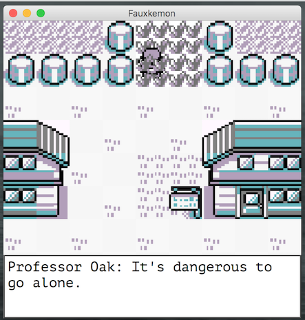
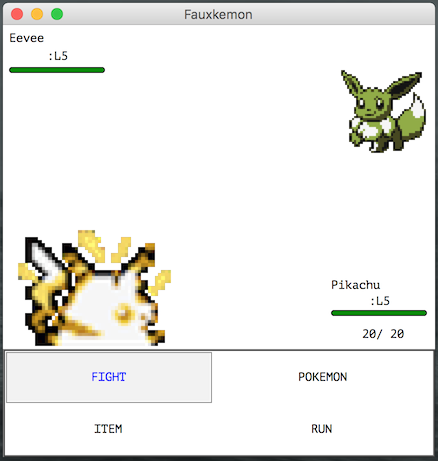
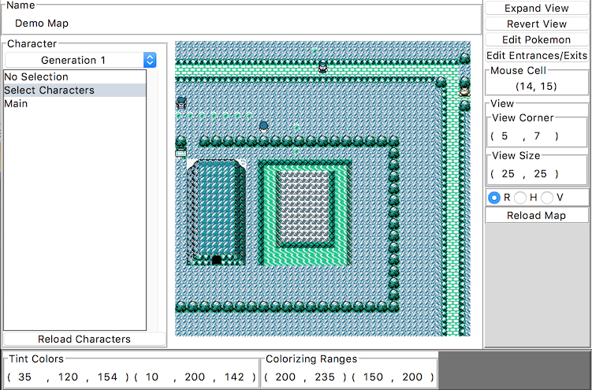

# python-fauxkemon

### What is this?

This is a ground-up, currently Mac-only rebuild (in python 3.4) of the original Pokemon games with potential for extension to later games. Ground up meaning not using pygame or any of the other libraries that the intelligent person would use--with an exception made for the Python Imaging Library (PIL), without which I would be stuck writing an image processing library.

Moreover, this means not using source code mined from the games, which means there will always be differences in feel and game-play relative to the games.

### Why do this?

Fun.

But also it means the game is fully editable and extensible. Effort was put into making the game easy to add to and extend and in the future it will probably become more so, particularly when all the game interfaces get split into their own package.

Plus a general purpose editor is provided to make many of the simpler editing and testing tasks easier, as well as templates for all events and effects, which are pure python files.

The documentation process is ongoing, as the code was written with myself as its sole intended user, but contact me and I'll add docstrings to any components of interest or update existing ones to be more explanatory.

### How do I use this?

The Fauxkemon.py file in Fauxkemon/app can be run from IDLE or the command-line, assuming one has PIL installed.

Alternatively, if one downloads the python-general repository and places this folder in the project directory, any virtual environment configured in the config folder of that repository can be easily used to run the code by simply running that repository's init.py file and selecting it from the menu provided.

That procedure will also allow for simple packaging of the application using the bash make_app function defined in python-general/config/init.sh on Fauxkemon.py